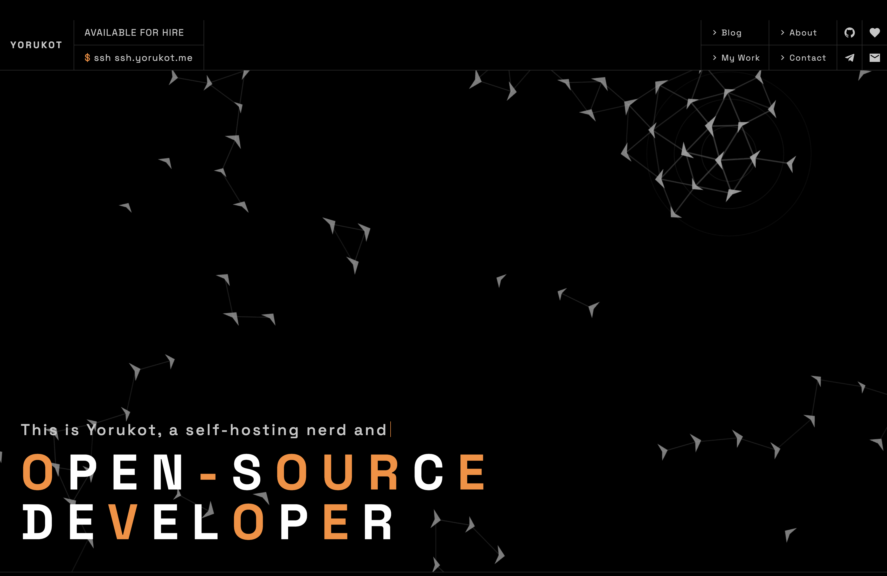

# yorukot.me



## Description

This is the source for `yorukot.me`, a personal website and blog. 

It includes a landing page, blog, shortlinks, newsletter subscription endpoint, RSS feed, sitemap, and generated Open Graph images.

You can also access the website experience over SSH with:

```sh
ssh ssh.yorukot.me
```

Detail: [github.com/yorukot/ssh.yorukot.me](https://github.com/yorukot/ssh.yorukot.me)

## How to build it

Requirements:

- Node.js `>= 22.12.0`
- `pnpm`

Install dependencies:

```sh
pnpm install
```

Start local development:

```sh
pnpm dev
```

Create a production build:

```sh
pnpm build
```

Preview the production build locally:

```sh
pnpm preview
```

Run the project checks:

```sh
pnpm lint
```

Deploy to Cloudflare:

```sh
pnpm deploy
```

## What tech this website uses

- [Astro](https://astro.build/) for the site framework
- [TypeScript](https://www.typescriptlang.org/) for typed scripts and routes
- [Tailwind CSS v4](https://tailwindcss.com/) for styling
- [Cloudflare](https://www.cloudflare.com/) via `@astrojs/cloudflare` for deployment
- [anime.js](https://animejs.com/) for motion
- [Satori](https://github.com/vercel/satori) and `sharp` for Open Graph image generation
- [unplugin-icons](https://github.com/unplugin/unplugin-icons) and Iconify for icons
