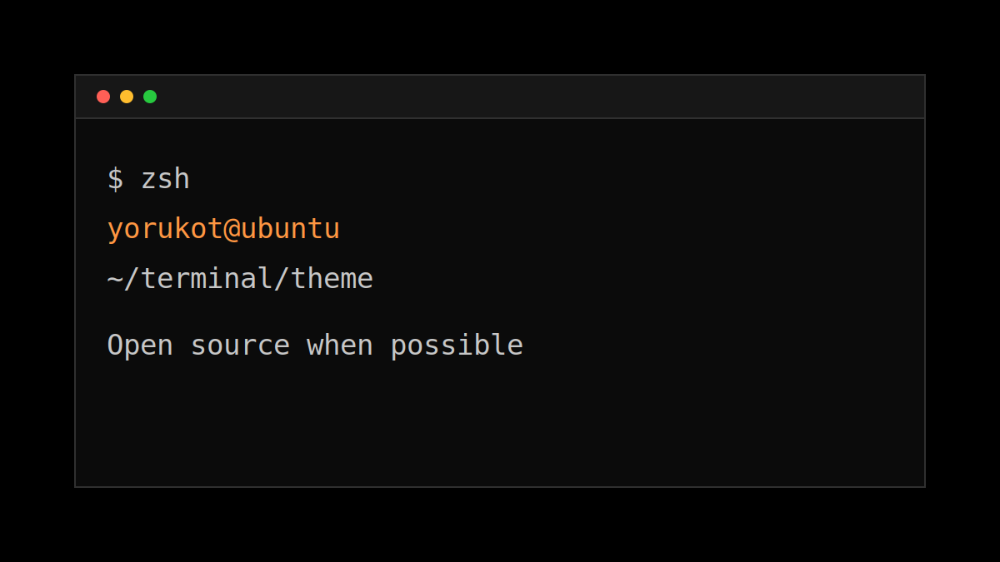

This is a sample markdown post for the local blog system.



## What This Post Can Include

Markdown posts can use normal markdown content:

- Headings
- Lists
- Links
- Inline code like `zsh`
- Code blocks
- Images stored beside `index.md`

```sh
sudo apt install zsh
```

Replace this sample with the full post when the content is ready.
